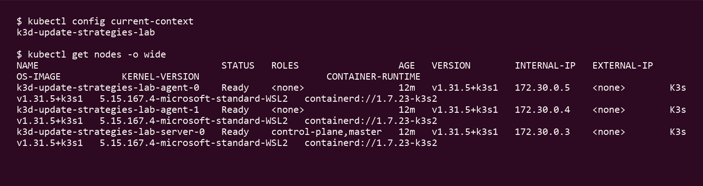
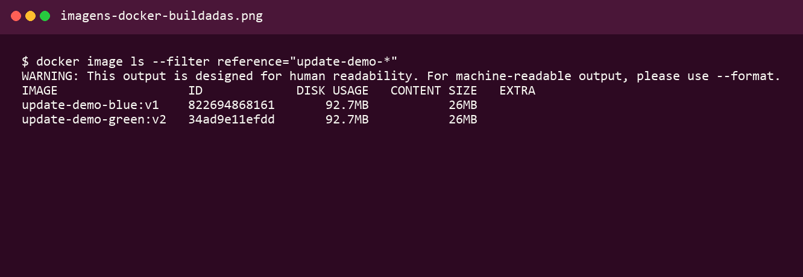
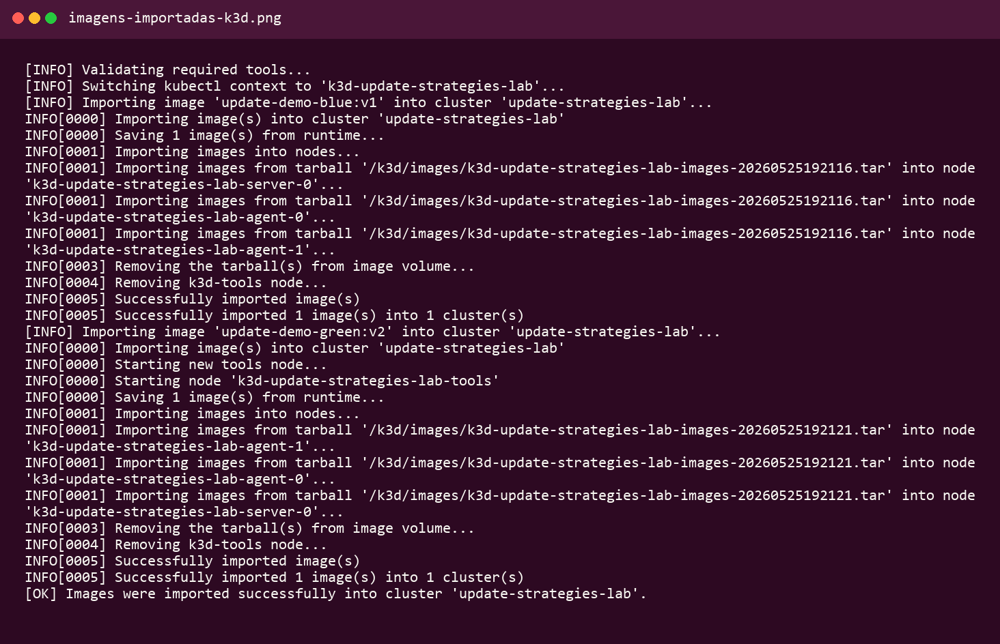
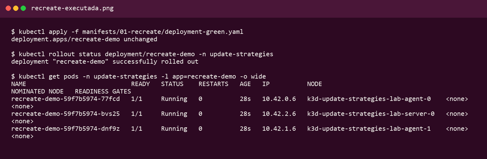
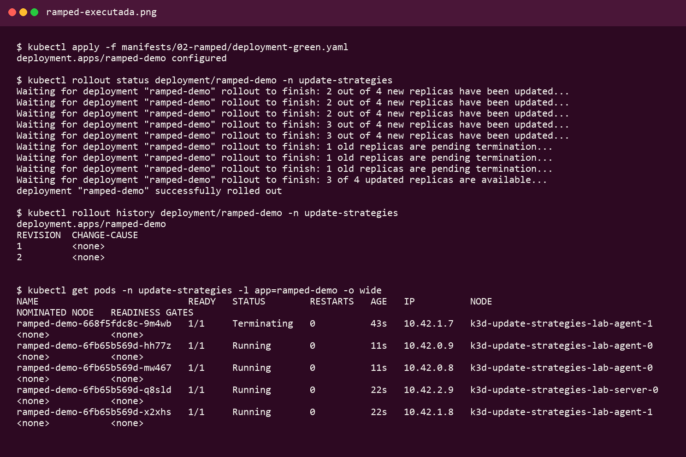
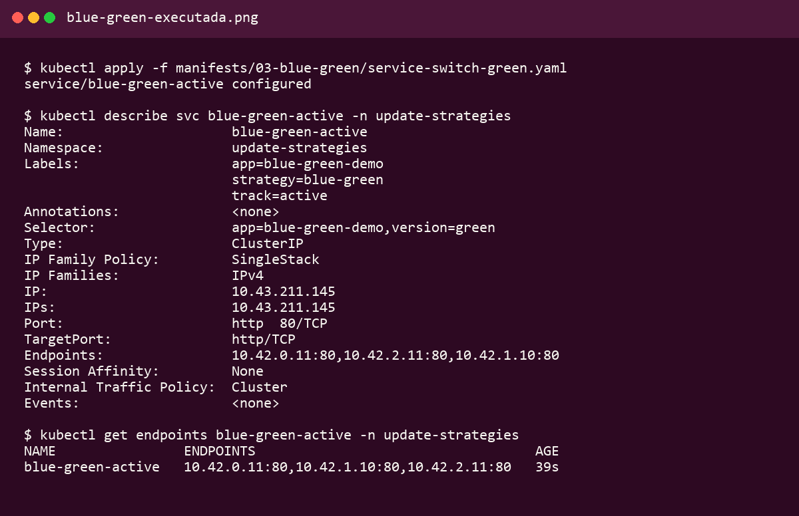
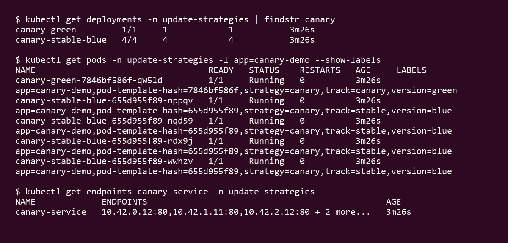
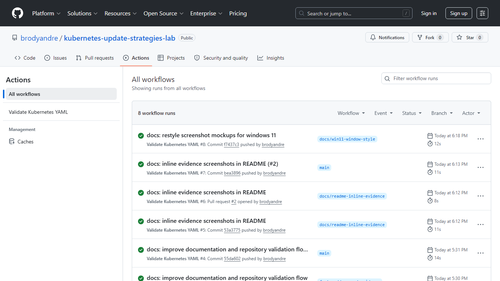
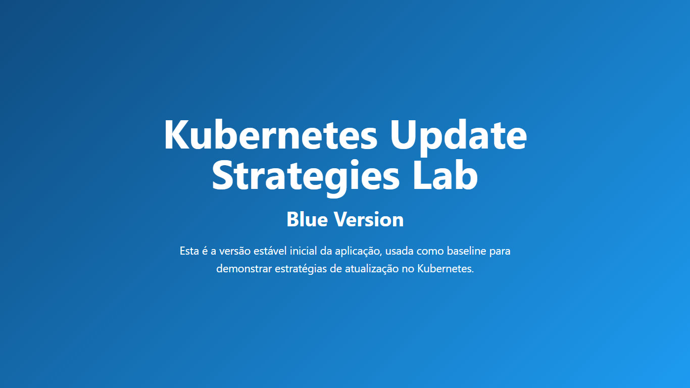
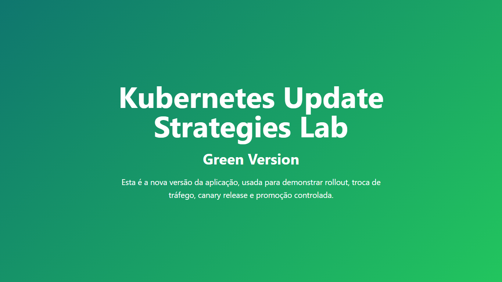

# Kubernetes Update Strategies Lab


Projeto prático para demonstrar estratégias reais de atualização de aplicações em Kubernetes, com foco em comportamento de rollout, seleção de tráfego, promoção de versões e organização operacional do ambiente.

O laboratório usa duas aplicações web estáticas servidas por Nginx, empacotadas como imagens Docker locais e executadas em um cluster `k3d`. A partir dessas duas versões, o projeto mostra como diferentes estratégias de atualização afetam disponibilidade, controle de risco e previsibilidade do processo de entrega.

<a id="indice"></a>

## Índice

- [Objetivo](#objetivo)
- [Aplicações do laboratório](#aplicações-do-laboratório)
- [Documentação detalhada por estratégia](#documentação-detalhada-por-estratégia)
- [Tabela comparativa das estratégias](#tabela-comparativa-das-estratégias)
- [Visão arquitetural do laboratório](#visão-arquitetural-do-laboratório)
- [Tecnologias utilizadas](#tecnologias-utilizadas)
- [Estrutura do projeto](#estrutura-do-projeto)
- [Pré-requisitos](#pré-requisitos)
- [Fluxo de execução recomendado](#fluxo-de-execução-recomendado)
- [Comandos principais](#comandos-principais)
- [Execução local completa](#execução-local-completa)
- [Evidências de execução](#evidências-de-execução)
- [Competências demonstradas](#competências-demonstradas)
- [Validação do repositório](#validação-do-repositório)
- [Próximos passos](#próximos-passos)

## Objetivo

Este repositório foi estruturado para estudar, executar e documentar quatro abordagens comuns de atualização de aplicações no Kubernetes:

- `Recreate`
- `Ramped / Rolling Update`
- `Blue / Green`
- `Canary`

Mais do que aplicar manifests, a proposta é evidenciar como Deployments, Services, labels, selectors e probes se combinam para viabilizar transições controladas entre uma versão estável `blue` e uma nova versão `green`.

[Voltar ao índice](#indice)

## Aplicações do laboratório

| Aplicação | Imagem | Papel no laboratório |
|---|---|---|
| Blue | `update-demo-blue:v1` | Versão estável inicial usada como baseline. |
| Green | `update-demo-green:v2` | Nova versão usada para atualização, validação e promoção. |

[Voltar ao índice](#indice)

## Documentação detalhada por estratégia

Os cenários do laboratório também estão documentados individualmente em arquivos próprios, úteis para revisão rápida, entrevistas técnicas e navegação direta no GitHub:

| Estratégia | Documento |
|---|---|
| Recreate | [docs/01-recreate.md](docs/01-recreate.md) |
| Ramped / Rolling Update | [docs/02-ramped-rolling-update.md](docs/02-ramped-rolling-update.md) |
| Blue / Green | [docs/03-blue-green.md](docs/03-blue-green.md) |
| Canary | [docs/04-canary.md](docs/04-canary.md) |

[Voltar ao índice](#indice)

## Tabela comparativa das estratégias

| Estratégia | Como funciona | Disponibilidade durante rollout | Vantagem principal | Ponto de atenção | Cenário de uso |
|---|---|---|---|---|---|
| `Recreate` | Remove os Pods antigos antes de criar os novos. | Pode haver indisponibilidade temporária. | Implementação simples e previsível. | Não mantém a aplicação disponível durante toda a troca. | Ambientes internos, testes controlados e janelas de manutenção. |
| `Ramped / Rolling Update` | Substitui os Pods gradualmente, mantendo parte da versão anterior ativa. | Alta, desde que as versões coexistam bem. | Atualização progressiva sem duplicar todo o ambiente. | Requer compatibilidade entre versões durante a transição. | Aplicações stateless com necessidade de continuidade de serviço. |
| `Blue / Green` | Mantém duas versões prontas e troca o tráfego via Service. | Alta, com troca explícita de destino. | Rollback rápido e validação prévia da nova versão. | Consome mais recursos por manter dois ambientes simultâneos. | Publicações controladas com necessidade de reversão rápida. |
| `Canary` | Direciona parte do tráfego para a nova versão antes da promoção total. | Alta, com exposição gradual da mudança. | Reduz risco ao limitar o alcance inicial da nova versão. | Exige observabilidade e acompanhamento mais cuidadoso. | Entregas progressivas em cenários com maior sensibilidade a falhas. |

[Voltar ao índice](#indice)

## Visão arquitetural do laboratório

O laboratório foi montado com uma arquitetura simples, mas suficiente para reproduzir decisões reais de rollout:

- Um cluster local `k3d` hospeda todos os recursos do experimento.
- O namespace `update-strategies` isola os objetos do laboratório.
- Duas imagens Docker locais representam as versões `blue` e `green` da aplicação.
- Cada estratégia possui manifests próprios em diretórios separados, facilitando estudo e execução independente.
- Os Services usam `ClusterIP` e dependem de `labels` e `selectors` para definir quais Pods recebem tráfego.
- Os Deployments incluem `readinessProbe` e `livenessProbe` HTTP na rota `/`, simulando um padrão mínimo de saúde operacional.

Em termos práticos, o laboratório destaca três mecanismos centrais do Kubernetes:

1. Atualização de Pods por meio de diferentes políticas de Deployment.
2. Comutação de tráfego com Services baseados em labels.
3. Promoção de versões com manifests explícitos e scripts de apoio.

[Voltar ao índice](#indice)

## Tecnologias utilizadas

- Kubernetes
- kubectl
- Docker
- k3d
- Nginx
- Bash
- YAML
- yamllint
- GitHub Actions

[Voltar ao índice](#indice)

## Estrutura do projeto

```text
kubernetes-update-strategies-lab/
├── README.md
├── apps/
│   ├── blue/
│   │   ├── Dockerfile
│   │   └── index.html
│   └── green/
│       ├── Dockerfile
│       └── index.html
├── manifests/
│   ├── 00-namespace/
│   │   └── namespace.yaml
│   ├── 01-recreate/
│   │   ├── deployment-blue.yaml
│   │   ├── deployment-green.yaml
│   │   └── service.yaml
│   ├── 02-ramped/
│   │   ├── deployment-blue.yaml
│   │   ├── deployment-green.yaml
│   │   └── service.yaml
│   ├── 03-blue-green/
│   │   ├── deployment-blue.yaml
│   │   ├── deployment-green.yaml
│   │   ├── service-active-blue.yaml
│   │   ├── service-preview-green.yaml
│   │   └── service-switch-green.yaml
│   └── 04-canary/
│       ├── deployment-stable-blue.yaml
│       ├── deployment-canary-green.yaml
│       ├── service.yaml
│       └── promote-green.yaml
├── scripts/
│   ├── setup.sh
│   ├── build-images.sh
│   ├── import-images-k3d.sh
│   ├── apply-recreate.sh
│   ├── apply-ramped.sh
│   ├── apply-blue-green.sh
│   ├── apply-canary.sh
│   ├── check.sh
│   └── cleanup.sh
└── .github/
    └── workflows/
        └── validate-kubernetes-yaml.yml
```

[Voltar ao índice](#indice)

## Pré-requisitos

- Docker em execução
- `kubectl`
- `k3d`
- Shell compatível com Bash
- `yamllint` opcional para validação local

Se necessário, ajuste as permissões dos scripts:

```bash
chmod +x scripts/*.sh
```

[Voltar ao índice](#indice)

## Fluxo de execução recomendado

Para aproveitar melhor o laboratório, a sequência abaixo ajuda a observar a evolução entre as estratégias:

1. Preparar o ambiente local no WSL2.
2. Criar o cluster `k3d`.
3. Buildar e importar as imagens `blue` e `green`.
4. Executar `Recreate` e observar a troca direta entre versões.
5. Executar `Ramped / Rolling Update` e acompanhar o rollout gradual.
6. Executar `Blue / Green`, validar preview e trocar o tráfego.
7. Executar `Canary`, observar a distribuição e promover a nova versão.
8. Verificar Pods, Deployments, Services, Endpoints e histórico de rollout.

[Voltar ao índice](#indice)

## Comandos principais

| Comando | Objetivo |
|---|---|
| `./scripts/setup.sh` | Criar o cluster `k3d`, ajustar o contexto e exibir os nodes. |
| `./scripts/build-images.sh` | Buildar as imagens `update-demo-blue:v1` e `update-demo-green:v2`. |
| `./scripts/import-images-k3d.sh` | Importar as imagens locais para o cluster `update-strategies-lab`. |
| `./scripts/apply-recreate.sh` | Aplicar a estratégia Recreate com a versão `blue`. |
| `./scripts/apply-ramped.sh` | Aplicar a estratégia Ramped / Rolling Update com a versão `blue`. |
| `./scripts/apply-blue-green.sh` | Aplicar os Deployments e Services da estratégia Blue / Green. |
| `./scripts/apply-canary.sh` | Aplicar a estratégia Canary com distribuição inicial entre `blue` e `green`. |
| `./scripts/check.sh` | Exibir namespace, Pods, Deployments, Services, Endpoints e rollout status. |
| `./scripts/cleanup.sh` | Remover o namespace `update-strategies` sem apagar o cluster. |
| `yamllint -c .yamllint.yml .` | Validar a qualidade dos arquivos YAML localmente. |

[Voltar ao índice](#indice)

## Execução local completa

Os comandos abaixo consideram um ambiente com Windows 11, WSL2, Docker Desktop, `kubectl` e `k3d`. Execute tudo a partir do terminal do Ubuntu no WSL2.

### 1. Clonar o repositório

```bash
git clone https://github.com/<seu-usuario>/kubernetes-update-strategies-lab.git
```

### 2. Entrar na pasta do projeto

```bash
cd kubernetes-update-strategies-lab
```

### 3. Dar permissão de execução aos scripts

```bash
chmod +x scripts/*.sh
```

### 4. Criar o cluster k3d

```bash
./scripts/setup.sh
kubectl config current-context
kubectl get nodes -o wide
```

### 5. Buildar as imagens Docker

```bash
./scripts/build-images.sh
docker images update-demo-*
```

### 6. Importar imagens para o cluster k3d

```bash
./scripts/import-images-k3d.sh
```

### 7. Aplicar a estratégia Recreate

```bash
./scripts/apply-recreate.sh
kubectl get deployment recreate-demo -n update-strategies
kubectl get pods -n update-strategies -l app=recreate-demo -o wide
```

Exemplo de acesso local no navegador:

```bash
kubectl port-forward svc/recreate-service -n update-strategies 8080:80
```

Abra `http://localhost:8080` no navegador do Windows.

### 8. Atualizar de blue para green com Recreate

```bash
kubectl apply -f manifests/01-recreate/deployment-green.yaml
kubectl rollout status deployment/recreate-demo -n update-strategies
kubectl describe deployment recreate-demo -n update-strategies
kubectl get pods -n update-strategies -l app=recreate-demo -o wide
```

### 9. Aplicar a estratégia Ramped

```bash
./scripts/apply-ramped.sh
kubectl get deployment ramped-demo -n update-strategies
kubectl get pods -n update-strategies -l app=ramped-demo -o wide
```

Exemplo de acesso local no navegador:

```bash
kubectl port-forward svc/ramped-service -n update-strategies 8081:80
```

Abra `http://localhost:8081` no navegador.

### 10. Atualizar de blue para green com Ramped

```bash
kubectl apply -f manifests/02-ramped/deployment-green.yaml
kubectl rollout status deployment/ramped-demo -n update-strategies
kubectl rollout history deployment/ramped-demo -n update-strategies
kubectl get pods -n update-strategies -l app=ramped-demo -o wide
```

### 11. Aplicar Blue/Green

```bash
./scripts/apply-blue-green.sh
kubectl get deployments -n update-strategies
kubectl get svc -n update-strategies
kubectl get endpoints -n update-strategies
```

Exemplo de acesso ao ambiente ativo:

```bash
kubectl port-forward svc/blue-green-active -n update-strategies 8083:80
```

Abra `http://localhost:8083` no navegador.

### 12. Testar preview do green

```bash
kubectl port-forward svc/blue-green-preview -n update-strategies 8082:80
```

Abra `http://localhost:8082` no navegador para validar a versão `green` em preview.

### 13. Trocar o tráfego para green no Blue/Green

```bash
kubectl apply -f manifests/03-blue-green/service-switch-green.yaml
kubectl describe svc blue-green-active -n update-strategies
kubectl get endpoints blue-green-active -n update-strategies
```

Depois da troca, o acesso em `http://localhost:8083` deve passar a responder com a versão `green`.

### 14. Aplicar Canary

```bash
./scripts/apply-canary.sh
kubectl get deployments -n update-strategies
kubectl get pods -n update-strategies -l app=canary-demo -o wide
```

Exemplo de acesso local no navegador:

```bash
kubectl port-forward svc/canary-service -n update-strategies 8084:80
```

Abra `http://localhost:8084` no navegador.

### 15. Verificar distribuição aproximada entre blue e green

```bash
kubectl get pods -n update-strategies -l app=canary-demo --show-labels
kubectl get endpoints canary-service -n update-strategies
kubectl describe deployment canary-stable-blue -n update-strategies
kubectl describe deployment canary-green -n update-strategies
```

### 16. Promover green

```bash
kubectl apply -f manifests/04-canary/promote-green.yaml
kubectl scale deployment canary-stable-blue -n update-strategies --replicas=0
kubectl scale deployment canary-green -n update-strategies --replicas=0
kubectl rollout status deployment/canary-stable-green -n update-strategies
kubectl get deployments -n update-strategies
```

### 17. Verificar recursos

Visão rápida do namespace:

```bash
./scripts/check.sh
```

Comandos úteis:

```bash
kubectl get pods -n update-strategies -o wide
kubectl get deployments -n update-strategies
kubectl get svc -n update-strategies
kubectl get endpoints -n update-strategies
kubectl describe deployment <nome> -n update-strategies
kubectl rollout status deployment/<nome> -n update-strategies
kubectl rollout history deployment/<nome> -n update-strategies
kubectl logs <pod> -n update-strategies
```

Teste HTTP interno:

```bash
kubectl run curl-test -n update-strategies --rm -it \
  --image=curlimages/curl --restart=Never -- \
  curl http://canary-service
```

### 18. Limpar o ambiente

Remover o namespace do laboratório:

```bash
./scripts/cleanup.sh
```

Remover também o cluster local, se necessário:

```bash
k3d cluster delete update-strategies-lab
```

[Voltar ao índice](#indice)

## Evidências de execução

Esta seção foi organizada para receber prints e imagens reais da execução do laboratório. A ideia é manter um conjunto de evidências que mostre tanto preparação do ambiente quanto comportamento das estratégias durante a execução.

### Mapa das evidências

| Evidência | Caminho sugerido | Comando ou contexto recomendado |
|---|---|---|
| Cluster k3d criado | `docs/images/cluster-k3d-criado.png` | `kubectl get nodes -o wide` |
| Imagens Docker buildadas | `docs/images/imagens-docker-buildadas.png` | `docker images update-demo-*` |
| Imagens importadas no k3d | `docs/images/imagens-importadas-k3d.png` | saída de `./scripts/import-images-k3d.sh` |
| Estratégia Recreate executada | `docs/images/recreate-executada.png` | `kubectl get pods -n update-strategies -l app=recreate-demo -o wide` |
| Estratégia Ramped executada | `docs/images/ramped-executada.png` | `kubectl rollout history deployment/ramped-demo -n update-strategies` |
| Estratégia Blue/Green executada | `docs/images/blue-green-executada.png` | `kubectl get svc,endpoints -n update-strategies` |
| Estratégia Canary executada | `docs/images/canary-executada.png` | `kubectl get pods -n update-strategies -l app=canary-demo --show-labels` |
| GitHub Actions validando YAML | `docs/images/github-actions-validando-yaml.png` | execução bem-sucedida do workflow `Validate Kubernetes YAML` |
| Aplicação blue no navegador | `docs/images/aplicacao-blue-navegador.png` | acesso via `kubectl port-forward` |
| Aplicação green no navegador | `docs/images/aplicacao-green-navegador.png` | acesso via preview ou promoção de `green` |

### Placeholders para prints

### 1. Cluster k3d criado



### 2. Imagens Docker buildadas



### 3. Imagens importadas no k3d



### 4. Estratégia Recreate executada



### 5. Estratégia Ramped executada



### 6. Estratégia Blue/Green executada



### 7. Estratégia Canary executada



### 8. GitHub Actions validando YAML



### 9. Aplicação blue no navegador



### 10. Aplicação green no navegador



[Voltar ao índice](#indice)

## Competências demonstradas

Este projeto evidencia prática nos seguintes pontos:

- Kubernetes Deployments
- Services
- Labels e Selectors
- Estratégias de rollout
- Probes
- Docker
- k3d
- Automação com scripts shell
- Organização de manifests YAML
- Validação com GitHub Actions
- Documentação técnica

[Voltar ao índice](#indice)

## Validação do repositório

O projeto inclui um workflow GitHub Actions para validar arquivos YAML com `yamllint`:

- Workflow: `.github/workflows/validate-kubernetes-yaml.yml`
- Configuração do lint: `.yamllint.yml`

Se quiser validar localmente:

```bash
yamllint -c .yamllint.yml .
```

[Voltar ao índice](#indice)

## Próximos passos

- Adicionar Ingress para facilitar testes externos.
- Incluir evidências visuais reais no README.
- Automatizar testes HTTP após cada rollout.
- Comparar este laboratório com abordagens como Argo Rollouts e Flagger.
- Publicar o projeto com histórico de execução e screenshots.

[Voltar ao índice](#indice)
